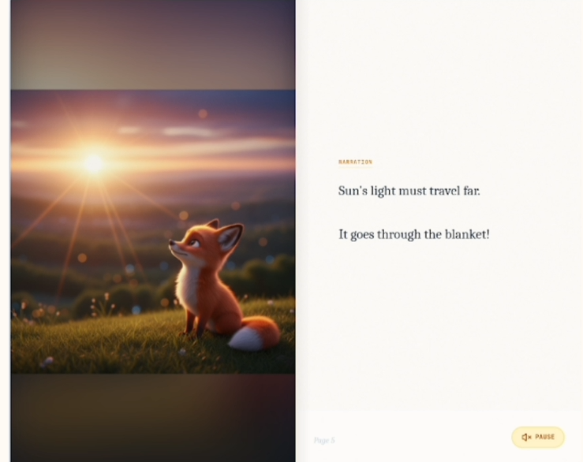

# Logitoon - AI Story Director

AI-powered children's picture book generator that transforms complex topics into engaging 12-panel visual stories.



[](https://www.youtube.com/watch?v=SmbaU7BjZRg)

## Features

- **Multi-Agent Pipeline**: Logic Expert → Story Author → Visual Director → Image Generator
- **12-Panel Storyboard**: Complete picture book experience with consistent art style
- **Multiple Art Styles**: 3D Clay, Ghibli Anime, Watercolor, Paper Cutout, Flat Vector
- **Text-to-Speech**: Auto-read narration with multi-language support (EN, KO, JA)
- **Offline Library**: IndexedDB caching for generated stories
- **Age-Appropriate Content**: Configurable for toddlers (3-5) or elementary (6-8)

## Tech Stack

- **Frontend**: React 19 + TypeScript + Vite
- **AI**: Google Gemini API (Text generation + Image generation)
- **Styling**: Tailwind CSS
- **Icons**: Lucide React

## Getting Started

### Prerequisites

- Node.js 18+
- Gemini API Key ([Get one here](https://aistudio.google.com/apikey))

### Installation

```bash
# Clone the repository
git clone https://github.com/YOUR_USERNAME/logitoon.git
cd logitoon

# Install dependencies
npm install

# Set up environment variables
cp .env.local.example .env.local
# Edit .env.local and add your GEMINI_API_KEY

# Start development server
npm run dev
```

### Environment Variables

Create a `.env.local` file in the root directory:

```
GEMINI_API_KEY=your_api_key_here
```

## Project Structure

```
logitoon/
├── src/
│   ├── components/      # React UI components
│   ├── services/        # Gemini API integration
│   ├── utils/           # IndexedDB, image utilities
│   ├── data/            # Featured topics data
│   ├── prompts/         # AI prompt engineering system
│   │   ├── versioned/   # Versioned prompts (logic, story, visual)
│   │   ├── styles/      # Art style definitions
│   │   └── validators/  # Child-safety validators
│   ├── App.tsx          # Main application component
│   ├── main.tsx         # Entry point
│   ├── types.ts         # TypeScript definitions
│   └── constants.ts     # Style library & configs
├── index.html
├── package.json
└── vite.config.ts
```

## How It Works

1. **User Input**: Enter any topic (e.g., "Why is the sky blue?")
2. **Logic Agent**: Breaks down the concept into child-friendly explanations
3. **Story Agent**: Writes a 12-panel narrative script
4. **Visual Agent**: Creates detailed image prompts for each panel
5. **Image Generation**: Generates illustrations using Gemini's image model
6. **Presentation**: Interactive storybook with page-turn animations and TTS

## Scripts

```bash
npm run dev      # Start development server
npm run build    # Build for production
npm run preview  # Preview production build
```

## License

MIT
